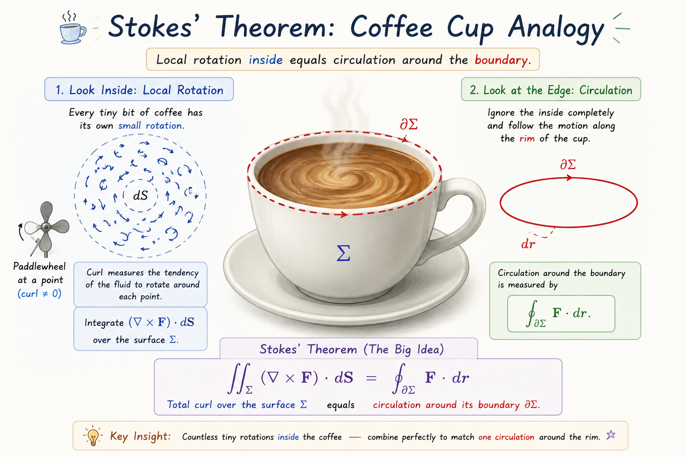
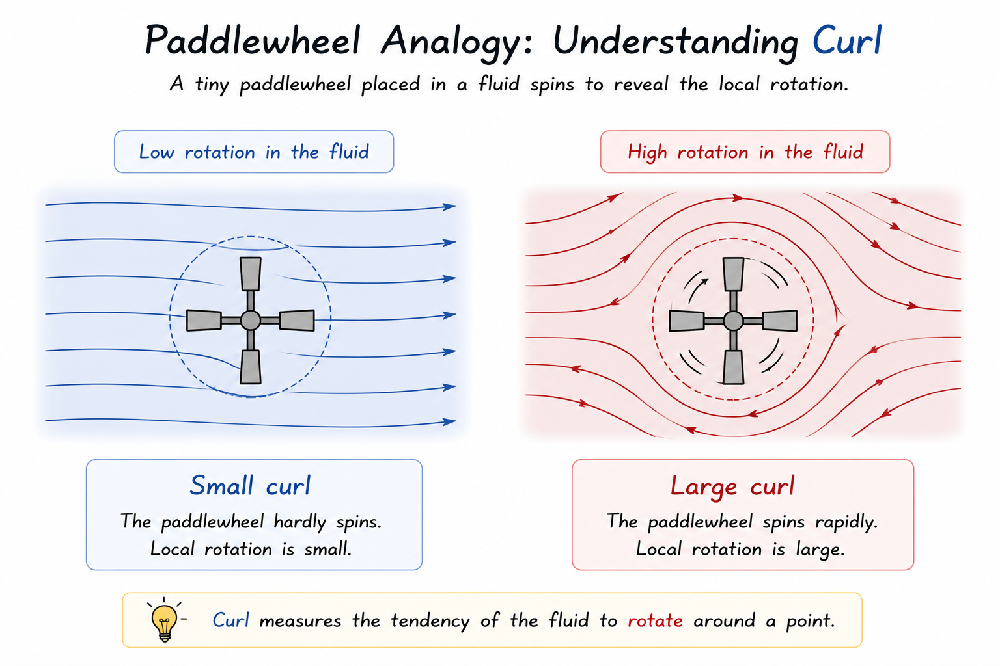
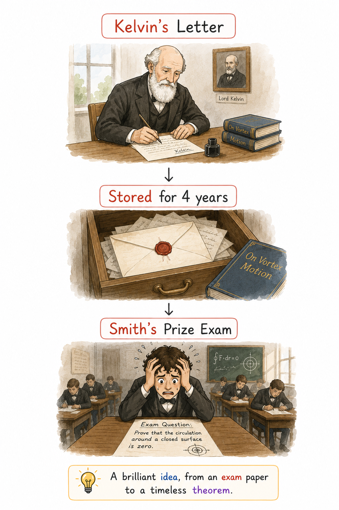
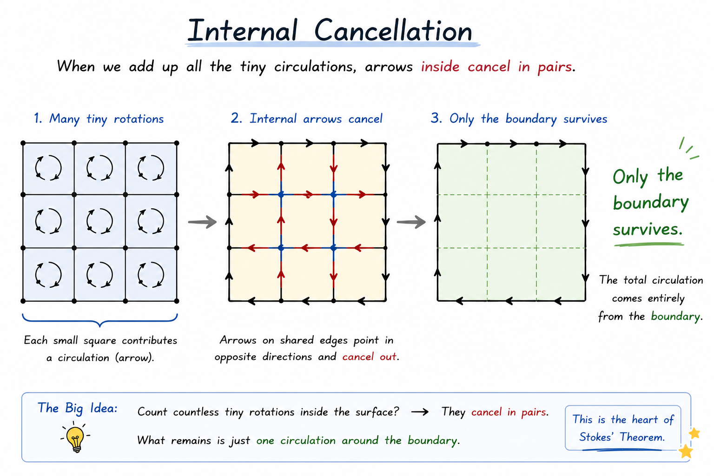
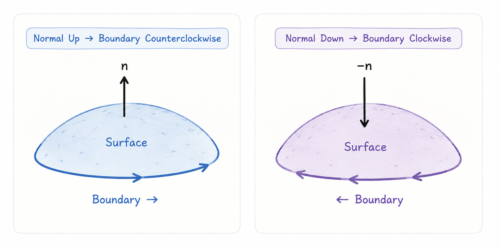
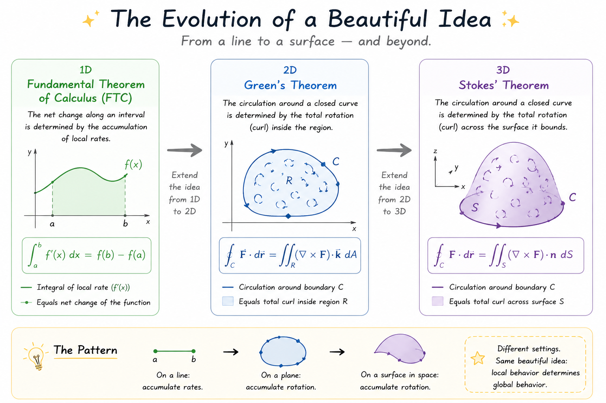

::: {.callout-note title="Group Information"}

**Group:** Malo

**Authors:** Liu Shiyun, Wang Zihan, Weng Xietong

{width=50% fig-align="center"}


:::


# Stokes' Theorem, Naming Rights, and a Little Bit of Luck

Most university calculus theorems are named after people. Green's Theorem. Gauss' Theorem. Stokes' Theorem. It almost sounds as if discovering a beautiful theorem is enough to earn your name a permanent place in every calculus textbook.

But mathematics is rarely that simple. The story of **Stokes' Theorem** is not only about a remarkable idea in vector calculus—it is also about friendship, forgotten letters, a last-minute examination, and a brilliant student who found an elegant way to solve a difficult problem.

More importantly, Stokes' Theorem teaches one of the most beautiful ideas in calculus: instead of studying every tiny detail inside a surface, we can often understand the whole picture simply by looking at its boundary. So how do you get a multivariable calculus theorem named after yourself?

As it turns out, the answer involves a smart friend, a little bit of luck, and some very beautiful mathematics.

# Step 1. Find a Smart Friend

Every great plan begins with Step 1. If you want a multivariable calculus theorem named after yourself, the first requirement is surprisingly simple: Find a friend who has beautiful mathematical ideas.

In 1850, George Stokes had exactly such a friend—**William Thomson**, later known as **Lord Kelvin** (yes, the same Kelvin behind the temperature scale). The two mathematicians often exchanged ideas through letters. While normal people in the 1850s wrote letters to gossip about neighbors or complain about theweather, Kelvin and Stokes preferred a different kind of romance: sending each other terrifying vector calculus equations. In one of these letters, Kelvin described a remarkable relationship between what happens **along the boundary** of a surface and what happens **inside** it.

Today, we write that idea as
$$\oint_{\partial S} \mathbf{F} \cdot d\mathbf{r} = \iint_S (\nabla \times \mathbf{F}) \cdot d\mathbf{S}$$
At first glance, the equation looks intimidating.

Fortunately, the idea behind it is much simpler than the notation suggests---

Imagine stirring a cup of coffee with a spoon. There are two different ways to describe the motion of the coffee. One way is to look **inside** the cup. Every tiny drop of coffee rotates a little differently. The other way is to ignore the inside completely and simply observe the motion around the **rim** of the cup. At first, these two viewpoints seem unrelated. One studies countless tiny rotations. The other only follows a single closed curve.

Surprisingly, This theorem tells us that these two descriptions are actually equivalent.
{width=100% fig-align="center"}
To describe those tiny local rotations, mathematicians use a quantity called the **curl**.
Mathematically, the curl of a vector field measures the limiting circulation per unit area around an infinitesimally small loop. In other words, it quantifies the local tendency of the field to rotate.
$$\nabla \times \mathbf{F} = \begin{vmatrix} \mathbf{i} & \mathbf{j} & \mathbf{k} \\ \partial_x & \partial_y & \partial_z \\ P & Q & R \end{vmatrix}$$ 
where $\mathbf{F} = (P, Q, R)$.
You can think of the curl as a tiny paddlewheel placed in the flowing coffee. If the paddlewheel spins, the curl is nonzero. If it stays still, the curl is zero.
{width=100% fig-align="center"}
In other words, the curl measures how strongly the vector field tends to rotate around each point.

This idea tells us something remarkable: If we add together the curl over the entire surface, we obtain exactly the circulation around its boundary. That is the beautiful idea Kelvin shared with Stokes in a single letter.


# Step 2. Panic Before an Exam

Four years passed, Kelvin's letter remained among Stokes' papers, and the beautiful idea was never formally published. It simply waited. Then, in 1854, something unexpected happened.

Stokes was asked to prepare questions for the **Smith's Prize Examination**, one of the most prestigious mathematics competitions at the University of Cambridge. The examination was famous for testing creativity rather than memorization, so students expected challenging and original questions. As the deadline approached, Stokes needed one more suitable problem. While looking through his notes, he came across Kelvin's old letter.

::: {.columns}

::: {.column width="60%"}

Elegant.

Difficult.

Slightly terrifying.

Perfect for Cambridge.

So, instead of leaving the theorem in a drawer, Stokes placed it on an exam paper. Now imagine that you are one of the students sitting in the examination hall. You turn the page and are asked to prove a theorem that has never appeared in any textbook.

No worked examples.

No lecture notes.

No YouTube tutorials.

No Indian guy on the internet explaining it in 5 minutes.

Just one question and a blank sheet of paper. It must have been an intimidating moment. Fortunately, among the candidates that year was a young student named **James Clerk Maxwell**. Maxwell did not know it yet, but his solution would reveal why the theorem works—not just what it says.

:::

::: {.column width="40%"}

{width=100%}

:::

:::
# Step 3. Find the Right Student

When James Clerk Maxwell saw the examination question, he faced a difficult challenge: How can we relate everything happening across an entire surface to what happens only around its boundary?

At first, the problem seems impossible. A curved surface contains infinitely many points. Exam time, unfortunately, does not. Studying every point individually would require an unreasonable amount of patience. Maxwell stared at the page,

A curved surface;

One theorem;

Almost no time.

There had to be a simpler way.
Then he came up an idea was surprisingly simple. Instead of studying the whole surface at once, why not divide it into many tiny pieces? If each piece is made small enough, the complicated curved surface becomes a collection of almost flat patches. A difficult three-dimensional problem suddenly becomes much easier to understand.
{width=100% fig-align="center"}
Each tiny patch has its own boundary. Notice what happens when two neighbouring patches share the same edge: One patch travels along the edge in one direction; The other travels along exactly the same edge—but in the opposite direction. When we add all the boundaries together, every internal edge appears twice with opposite orientations. As a result, they cancel each other perfectly. 

Something remarkable now happens. As more and more patches are added together, every interior boundary quietly cancels. Only the outer boundary remains. **But Maxwell noticed one subtle detail.** The cancellation above is not automatic, it only works if every tiny boundary follows a consistent direction.

Then how do we know which direction each boundary should be traversed? The cancellation above is not automatic. It only works if every tiny patch follows a consistent choice of orientation. Once the orientation of the surface is fixed, the direction of every boundary is determined automatically. This relationship is established by the right-hand rule. If your thumb points along the chosen surface normal, the curl of your fingers indicates the positive direction around the boundary.
{width=100% fig-align="center"}
According to the right-hand rule, the positive direction of the boundary is determined by the orientation of the surface. If the surface normal is reversed, the boundary direction must also reverse.
$$
\mathbf{n}\;\rightarrow\;-\mathbf{n}
$$

$$
\Downarrow
$$

$$
\oint_{\partial\Sigma}\mathbf{F}\cdot d\mathbf{r}
\;\rightarrow\;
-\oint_{\partial\Sigma}\mathbf{F}\cdot d\mathbf{r}
$$

$$
\iint_{\Sigma}(\nabla\times\mathbf{F})\cdot\mathbf{n}\,dS
\;\rightarrow\;
-\iint_{\Sigma}(\nabla\times\mathbf{F})\cdot\mathbf{n}\,dS
$$

Both sides change sign. Therefore, Stokes' Theorem still holds.

This idea was not entirely new. In fact, It is exactly what Green's Theorem tells us in two dimensions:
$$\oint_C \mathbf{F} \cdot d\mathbf{r} = \iint_R (\nabla \times \mathbf{F}) \cdot \mathbf{k} \, dA$$
Maxwell realized that if each sufficiently small patch is regarded as approximately planar, Green’s theorem can be applied locally. After all the internal boundaries disappeared, the result naturally extended from a flat region to a curved surface.

This is exactly the idea behind Stokes' Theorem.
{width=100% fig-align="center"}
Each theorem follows the same philosophy: Stokes’ Theorem can actually be viewed as the three-dimensional extension of Green’s Theorem, while Green’s Theorem itself extends the Fundamental Theorem of Calculus. local information accumulates to determine a global quantity. This is why Stokes' Theorem is not an isolated result. Instead, it is part of a beautiful pattern that appears again and again throughout calculus.

## 🎮 Explore the Geometry Yourself

```{python}
#| echo: false

import numpy as np
import plotly.graph_objects as go

# ========== 1. 曲面 Σ：单位球面上半部分（穹顶） ==========
phi = np.linspace(0, np.pi / 2, 60)
theta = np.linspace(0, 2 * np.pi, 60)
PHI, THETA = np.meshgrid(phi, theta)

X = np.sin(PHI) * np.cos(THETA)
Y = np.sin(PHI) * np.sin(THETA)
Z = np.cos(PHI)

fig = go.Figure()

# --- trace 0: 曲面（实心，Step 1~3 使用） ---
fig.add_trace(go.Surface(
    x=X, y=Y, z=Z,
    colorscale=[[0, "rgb(144,237,243)"], [1, "rgb(155,225,220)"]],
    opacity=0.55,
    showscale=False,
    showlegend=False,
    visible=True,
    lighting=dict(ambient=0.6, diffuse=0.8, specular=0.25, roughness=0.5),
    hoverinfo="skip",
))

# --- trace 1: 曲面（淡出版本，Step 4 使用，暗示内部贡献正在抵消） ---
fig.add_trace(go.Surface(
    x=X, y=Y, z=Z,
    colorscale=[[0, "rgb(144, 237, 243)"], [1, "rgb(155, 225, 220)"]],
    opacity=0.12,
    showscale=False,
    showlegend=False,
    visible=False,
    hoverinfo="skip",
))

# --- trace 2: 曲面法向量（黑色箭头） ---
phi_n = np.linspace(0.15, np.pi / 2 - 0.1, 5)
theta_n = np.linspace(0, 2 * np.pi, 8, endpoint=False)
PHI_N, THETA_N = np.meshgrid(phi_n, theta_n)
PHI_N, THETA_N = PHI_N.flatten(), THETA_N.flatten()

nx = np.sin(PHI_N) * np.cos(THETA_N)
ny = np.sin(PHI_N) * np.sin(THETA_N)
nz = np.cos(PHI_N)

fig.add_trace(go.Cone(
    x=nx, y=ny, z=nz,
    u=nx, v=ny, w=nz,
    colorscale=[[0, "black"], [1, "black"]],
    showscale=False,
    sizemode="absolute",
    sizeref=0.22,
    anchor="tail",
    visible=True,
    showlegend=False,
    hoverinfo="skip",
))

# ========== 2. 内部微小旋转环（Step 3 使用，代表局部 curl） ==========
loop_phi = np.linspace(0.2, np.pi / 2 - 0.15, 6)
loop_theta = np.linspace(0, 2 * np.pi, 10, endpoint=False)
LP, LT = np.meshgrid(loop_phi, loop_theta)
LP, LT = LP.flatten(), LT.flatten()

loop_r = 0.09
a = np.linspace(0, 2 * np.pi, 14)

loop_x, loop_y, loop_z = [], [], []
arrow_x, arrow_y, arrow_z = [], [], []
arrow_u, arrow_v, arrow_w = [], [], []

for phi_i, theta_i in zip(LP, LT):
    p = np.array([np.sin(phi_i) * np.cos(theta_i),
                  np.sin(phi_i) * np.sin(theta_i),
                  np.cos(phi_i)])
    n = p  # 球面上，外法向 = 位置向量本身

    helper = np.array([0.0, 0.0, 1.0]) if abs(n[2]) < 0.9 else np.array([1.0, 0.0, 0.0])
    e1 = np.cross(n, helper); e1 /= np.linalg.norm(e1)
    e2 = np.cross(n, e1)  # (e1, e2, n) 构成右手系 → 逆时针方向与外法向满足右手定则

    circle = p[:, None] + loop_r * (np.cos(a)[None, :] * e1[:, None] + np.sin(a)[None, :] * e2[:, None])
    loop_x.extend(circle[0].tolist() + [None])
    loop_y.extend(circle[1].tolist() + [None])
    loop_z.extend(circle[2].tolist() + [None])

    tip = p + loop_r * e1
    arrow_x.append(tip[0]); arrow_y.append(tip[1]); arrow_z.append(tip[2])
    arrow_u.append(e2[0]); arrow_v.append(e2[1]); arrow_w.append(e2[2])

# --- trace 3: 小旋转环线条 ---
fig.add_trace(go.Scatter3d(
    x=loop_x, y=loop_y, z=loop_z,
    mode="lines",
    line=dict(color="blue", width=4),
    visible=False,
    showlegend=False,
    hoverinfo="skip",
))

# --- trace 4: 小旋转环的方向箭头 ---
fig.add_trace(go.Cone(
    x=arrow_x, y=arrow_y, z=arrow_z,
    u=arrow_u, v=arrow_v, w=arrow_w,
    colorscale=[[0, "orange"], [1, "orange"]],
    showscale=False,
    sizemode="absolute",
    sizeref=0.12,
    anchor="tail",
    visible=False,
    showlegend=False,
    hoverinfo="skip",
))

# ========== 3. 边界曲线 ∂Σ（赤道圆，红色） ==========
t = np.linspace(0, 2 * np.pi, 200)
bx, by, bz = np.cos(t), np.sin(t), np.zeros_like(t)

# --- trace 5: 红色边界线 ---
fig.add_trace(go.Scatter3d(
    x=bx, y=by, z=bz,
    mode="lines",
    line=dict(color="red", width=8),
    visible=False,
    showlegend=False,
    hoverinfo="skip",
))

# --- trace 6: 边界方向箭头 ---
idx = np.linspace(0, len(t) - 2, 8).astype(int)
tan_x = -np.sin(t[idx])
tan_y = np.cos(t[idx])
tan_z = np.zeros_like(tan_x)

fig.add_trace(go.Cone(
    x=bx[idx], y=by[idx], z=bz[idx],
    u=tan_x, v=tan_y, w=tan_z,
    colorscale=[[0, "red"], [1, "red"]],
    showscale=False,
    sizemode="absolute",
    sizeref=0.15,
    anchor="tail",
    visible=False,
    showlegend=False,
    hoverinfo="skip",
))

# ========== 4. 文字标签 ==========
# --- trace 7: Surface Σ 标签 ---
fig.add_trace(go.Scatter3d(
    x=[0], y=[0], z=[0.55],
    mode="text",
    text=["<b>Surface Σ</b>"],
    textfont=dict(size=18, color="black"),
    visible=True,
    showlegend=False,
    hoverinfo="skip",
))

# --- trace 8: Boundary ∂Σ 标签 ---
fig.add_trace(go.Scatter3d(
    x=[1.3 * np.cos(np.pi / 4)], y=[1.3 * np.sin(np.pi / 4)], z=[0],
    mode="text",
    text=["<b>Boundary ∂Σ</b>"],
    textfont=dict(size=18, color="red"),
    visible=False,
    showlegend=False,
    hoverinfo="skip",
))

# ========== 5. 五个动画步骤：每步对应一组 9 个 trace 的可见性 ==========
# 顺序须与上面 add_trace 的顺序完全一致：
# [曲面实心, 曲面淡出, 法向量, 旋转环线, 旋转环箭头, 边界线, 边界箭头, Surface标签, Boundary标签]

PLAIN_TITLE = "Stokes' Theorem:  ∮<sub>∂Σ</sub> F·dr = ∬<sub>Σ</sub> (∇×F)·dS"

# Step 6 用的标题：左边(线积分)染红，右边(曲面积分)染青，末尾追加绿色对勾
HIGHLIGHT_TITLE = (
    "Stokes' Theorem:&nbsp; "
    "<span style='color:#d62728'>∮<sub>∂Σ</sub> F·dr</span>"
    " &nbsp;=&nbsp; "
    "<span style='color:#008080'>∬<sub>Σ</sub> (∇×F)·dS</span>"
    "&nbsp;&nbsp;<span style='color:#2ca02c'><b>✓ Equal</b></span>"
)

steps = [
    dict(
    label="① Surface",
    visible=[True, False, True, False, False, False, False, True, False],
    text="Step 1 — Start with the surface Σ: a smooth, oriented surface.",
    title=PLAIN_TITLE,
    ),

    dict(
    label="② Boundary",
    visible=[True, False, True, False, False, True, True, True, True],
    text="Step 2 — The boundary curve ∂Σ appears. Its positive direction is determined by the right-hand rule.",
    title=PLAIN_TITLE,
    ),

    dict(
    label="③ Curl",
    visible=[True, False, True, True, True, True, True, True, True],
    text="Step 3 — Tiny local rotations cover the surface. Each loop represents $(\\nabla\\times\\mathbf{F})\\cdot d\\mathbf{S}$.",
    title=PLAIN_TITLE,
    ),

    dict(
    label="④ Internal Cancellation",
    visible=[False, True, False, False, False, True, True, False, True],
    text="Step 4 — Circulations along shared interior edges cancel in pairs, leaving only the outer boundary.",
    title=PLAIN_TITLE,
    ),

    dict(
    label="⑤ Stokes' Theorem",
    visible=[False, False, False, False, False, True, True, False, True],
    text="Step 5 — After cancellation, only the boundary integral remains: $\\iint_\\Sigma (\\nabla\\times\\mathbf{F})\\cdot d\\mathbf{S}=\\oint_{\\partial\\Sigma}\\mathbf{F}\\cdot d\\mathbf{r}$.",
    title=PLAIN_TITLE,
    ),

    dict(
    label="⑥ Verification ✓",
    visible=[False, False, False, False, False, True, True, False, True],
    text="Step 6 — Both sides are evaluated independently and produce the same value. Stokes' Theorem is verified.",
    title=PLAIN_TITLE,
    ),
]

buttons = [
    dict(
        label=s["label"],
        method="update",
        args=[{"visible": s["visible"]},
              {"title.text": s["title"],
               "annotations": [dict(
                   text=s["text"], x=0.5, y=1.08, xref="paper", yref="paper",
                   showarrow=False, font=dict(size=14, color="#333"),
               )],
               "transition": {"duration": 400, "easing": "cubic-in-out"}}],
    )
    for s in steps
]

# ========== 6. 布局：唯一标题，无图例，隐藏坐标轴，底部动画按钮 ==========
fig.update_layout(
    title="Stokes' Theorem:  ∮<sub>∂Σ</sub> F·dr = ∬<sub>Σ</sub> (∇×F)·dS",
    showlegend=False,
    scene=dict(
        xaxis=dict(visible=False),
        yaxis=dict(visible=False),
        zaxis=dict(visible=False),
        aspectmode="data",
        camera=dict(eye=dict(x=1.4, y=1.4, z=0.9)),
    ),
    margin=dict(l=0, r=0, t=90, b=60),
    paper_bgcolor="white",
    annotations=[dict(
        text=steps[0]["text"], x=0.5, y=1.08, xref="paper", yref="paper",
        showarrow=False, font=dict(size=14, color="#333"),
    )],
    updatemenus=[dict(
        type="buttons",
        direction="right",
        x=0.5, xanchor="center",
        y=-0.05, yanchor="top",
        showactive=True,
        buttons=buttons,
        font=dict(size=12),
    )],
)

fig  # Quarto/Jupyter 引擎会把这个裸表达式当作 cell 输出，嵌入交互式图表
```


You can press the button, rotate the figure with your mouse to explore the surface and its boundary.

# Conclusion

At first, Stokes' Theorem may seem like just another complicated equation in a calculus textbook.

However, behind the symbols lies a surprisingly simple idea: instead of studying every tiny detail inside a surface, we can often understand the whole picture by looking at its boundary.

Along the way, we also discovered that mathematical discoveries are rarely the work of a single person. The history of Stokes' Theorem involved Kelvin's insight, Stokes' examination question, and Maxwell's elegant reasoning. Together, they transformed a beautiful observation into one of the cornerstones of vector calculus.

Today, Stokes' Theorem continues to play an important role in fluid dynamics, electromagnetism, engineering, and many other areas of science. While its greatest value is not simply the number of applications it has.

Rather, it reminds us that mathematics is about discovering hidden connections. A cup of coffee, a nineteenth-century examination, and a theorem written in a modern calculus textbook may seem completely unrelated. However, they are all connected by one elegant idea.

Stokes’ Theorem is not merely a computational formula. It reveals one of the deepest principles in mathematics: global behaviour can emerge from local information. Perhaps this is why Stokes’ Theorem continues to inspire mathematicians, physicists, and engineers more than 170 years after it first appeared.